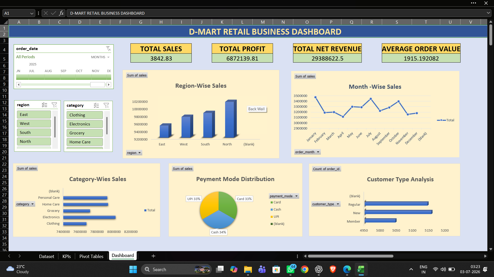

 🛒 D-Mart Retail Business Dashboard

📌 Project Overview

This project is an interactive Retail Business Dashboard built in Microsoft Excel to analyze sales performance, profit, customer trends, and product category performance.

## 📊 Dashboard Preview

🎯 Objectives

- Analyze sales performance
- Monitor profit and revenue
- Track category-wise sales
- Compare monthly performance
- Visualize business KPIs
- Enable interactive filtering using slicers
- Provide business insights through interactive visualizations

🛠 Tools Used

- Microsoft Excel
- Pivot Tables
- Pivot Charts
- Slicers
- KPI Cards
- Conditional Formatting
- Excel Formulas

📈 Dashboard Features

- Sales Analysis
- Profit Analysis
- Category-wise Performance
- Monthly Sales Trend
- Interactive Filters (Slicers)
- KPI Summary
- Dynamic Charts
  
📂 Dataset

The dataset contains retail sales information including:

- Order ID
- Product Name
- Category
- Sales
- Profit
- Quantity
- Customer Details
- Order Date

📊 Business Insights

Sales Performance
- Analyzed overall sales trends over time.
- Identified high-performing months.

Product Analysis
- Identified top-selling products.
- Compared category performance.

Customer Analysis
- Analyzed customer purchase patterns.
- Tracked customer contribution to revenue.

Profit Analysis
- Compared profit across different product categories.
- Identified profitable business segments.

📈 Skills Demonstrated

- Data Cleaning
- Data Analysis
- Dashboard Design
- Business Intelligence
- Excel Reporting
- Data Visualization
- KPI Development
- Analytical Thinking

👩‍💻 Author

**Rutuja Jadhav**

Aspiring Data Analyst

Skills: Excel | SQL | Power BI | Python | Data Analysis
